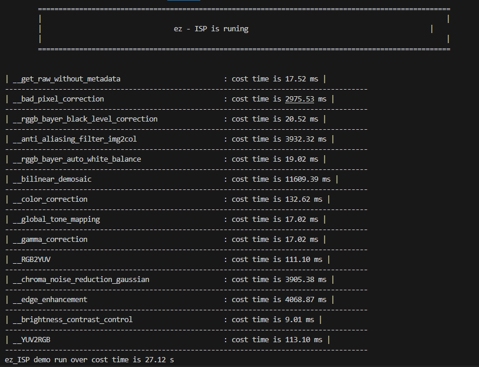

# ez_ISP : a easy_ISP for RAW to RGB conversion


## 介绍

这是一个简单的ISP（即：ez_ISP），用于将RAW转换为RGB。它基于`numpy`包，易于使用和理解。ez_ISP项目由python实现，可通过改写为C / C ++以加快速度。

- [x] Bad Pixel Correction， 坏点校正
- [x] Black Level Correction， 黑电平校正
- [x] Anti Aliasing Filter， 抗混叠
- [x] Bayer Noise Reduction， RAW域去噪
- [x] Auto White Balance， 自动白平衡
- [x] Color Filter Array Interpolation， 去马赛克
- [x] Color Correction Matrix， 颜色矫正
- [x] Global Tone Mapping， 全局色调映射
- [x] Gamma Correction， Gamma映射
- [x] Edge Enhancement， 边缘增强
- [x] Brightness Contrast Control，亮度控制
- [x] Chorma Noise Reduction，Chorma域去噪
- [ ] Lens Shading Correction， 阴影矫正
- [ ] Luma Noise Reduction， Luma域去噪
- [ ] Local Tone Mapping， 局部色调映射

## 文件结构

这个ez_ISP项目的树形结构如下所示。

```shell
```shell
ez_ISP
│  .gitignore
│  run.py
|  isp_pipeline.py
│  LICENSE
│  README.md
│
├─config
│      isp_config.yaml
│
├─assets
│      raw.png
│
├─algorithm
|     __init__.py
|     aaf.py
|     awb.py
│     bcc.py
│     blc.py
│     bnr.py
│     bpc.py
│     ccm.py
│     cfa.py
│     cnr.py
│     ee.py
|     fir.py
|     gmc.py
|     gtm.py
|     ltm.py
|     r2y.py
│     utils.py
│     y2r.py
│
├─test_images
│      test.RAW
│
```
设备：AMD Ryzen 5 5600 6-Core Processor@4.20 GHz，图像分辨率：1920x1080，运行时间如下：

|Module             |ez_ISP |
|:-----------------:|:------:|
|BPC                |2975.53 ms|
|BLC                |20.52 ms|
|AAF                |3932.32 ms|
|AWB                |19.02 ms |
|BNR                |73.99 ms|
|CFA                |11609.39 ms|
|CCM                |132.62 ms |
|GTM                |17.02 ms |
|GAC                |17.02 ms |
|R2Y                |111.10 ms |
|CNR                |3905.38 ms|
|EE                 |4068.87.1s |
|HSC                |56.34 ms|
|BBC                |9.01 ms |
|Total pipeline     |27.12 s |

耗时如上，虽然不够快，但是易于使用和理解。

## 安装
你可以通过pip安装下面的包来安装ez_ISP。
- The main package is `numpy`, and `opencv-python` is used for image I/O. 
- Other packages are used for the demo such as `rawpy` and `yaml`, `time`, `os`.
```bash
pip install yaml, numpy, opencv-python, time, rawpy, os, path
```
然后git clone ez_ISP项目，你就可以运行项目了。
```bash
git clone https://github.com/HuiiJi/ez_ISP.git
cd ez_ISP
```
确保你已经安装了上面的包，否则你运行项目时会报错。

## 如何使用
ez_ISP项目由`run.py`文件运行。

```python
python run.py
```


在你运行`run.py`文件之前，请先配置`config/isp_config.yaml`文件，配置文件如下所示。

```yaml
# -------------------- ISP Module Enable/Disable --------------------
enable:                
  BPC: True
  LCS: False                 # not implemented yet
  BLC: True
  AAF: True
  AWB: True
  BNR: False                 # not implemented yet
  CFA: True
  CCM: True
  GTM: True
  GMC: True
  R2Y: True
  CNR: True
  EE:  True
  BCC: True
  HSC: False                 # not implemented yet
  Y2R: True

# -------------------- Algorithm Params --------------------
RAW_img_path: '/mnt/cvisp/isp/ez_ISP/test_images/2DNR_Case_1_1.raw'
RAW_Height: 1080
RAW_Width: 1920
white_level: 1023
bayer_pattern: RGGB

BPC:
  bad_pixel_threshold: 30

LCS: ~

BLC:
  black_level_r: 256.0
  black_level_gr: 256.0
  black_level_gb: 256.0
  black_level_b: 256.0
  alpha: 1.        
  beta: 1.                  

AAF: ~

AWB:
  r_gain:  1.6             
  b_gain: 2.0            

BNR:
  BNR_method: 'bilateral'

CFA:
  CFA_method: 'bilinear'

CCM:
  ccm_matrix:
    - [1.631906, -0.381807, -0.250099]
    - [-0.298296, 1.614734, -0.316438]
    - [0.023770, -0.538501, 1.514732 ]

GTM:
  GTM_method: 'smoothstep'

GMC:
  gamma: 2.0

R2T: ~

CNR:
  CNR_method: 'gaussian'
  CNR_threshold: 0.3

EE:
  edge_enhancement_strength: 0.3

BCC:
  BCC_contrast: 0.1
  BCC_brightness: 10

HSC: ~

Y2R: ~
```
这个配置文件包含了所有的ISP模块，你可以根据你的需要来配置这些模块。

The params are listed as follows.
- `enable`: enable or disable the ISP module.
- `RAW_img_path`: the path of the RAW image.
- `RAW_Height`: the height of the RAW image.
- `RAW_Width`: the width of the RAW image.
- `white_level`: the white level of the RAW image.
- `bayer_pattern`: the bayer pattern of the RAW image.

如果你不想使用某个模块，你可以将其`enable`设置为`False`。你必须配置的是`RAW_img_path`，`RAW_Height`，`RAW_Width`，其他的参数你可以根据你的需要来配置。结果将会保存在`demo_outputs`文件夹中。

## 课程
这里是一些关于ISP的课程，你可以从这些课程中了解更多关于ISP的知识。

### 相机相关
- [ISP Pipe1， 了解](https://web.stanford.edu/class/cs231m/lectures/lecture-11-camera-isp.pdf)
- [ISP Pipe2， 了解](http://www.cs.cmu.edu/afs/cs/academic/class/15869-f11/www/lectures/16_camerapipeline1.pdf)
- [ISP Pipe3， 了解](http://graphics.cs.cmu.edu/courses/15-463/2017_fall/lectures/lecture2.pdf)

你可以从这些课程中了解更多关于ISP的知识，但是我认为这些课程对我来说并不是很有用，因为我不是一个相机工程师，我只是想学习ISP算法，所以我认为下面的课程对我来说更有用。
### 计算摄影
- [Camera History， 了解](http://www.cs.cornell.edu/courses/cs6640/2012fa/slides/01-History.pdf)
- [Recommend for ISP，推荐](https://www.eecs.yorku.ca/~mbrown/ICCV19_Tutorial_MSBrown.pdf)
- [Digital Photomontage，了解](https://graphics.stanford.edu/talks/compphot-publictalk-may08.pdf)
- [Marc大佬开课，强烈推荐](https://sites.google.com/site/marclevoylectures/schedule)

## 参考
这里是一些开源的ISP项目，这些项目对我完成这个项目非常有帮助。
### Python

- [openISP](https://github.com/cruxopen/openISP)
- [fast-openISP](https://github.com/QiuJueqin/fast-openISP)
### C/C++

- [HDR-ISP](https://github.com/JokerEyeAdas/HDR-ISP)
- [ISPLab](https://github.com/yuqing-liu-dut/ISPLab)

## License
[MIT](https://choosealicense.com/licenses/mit/)
感谢你的关注！
如果你有任何问题，请联系我@HuiiJi。


